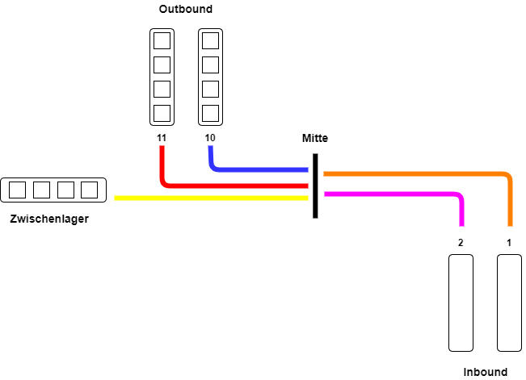

# Augemented Reality in der Logisitk


<small>Ein Projekt der Hochschule Kempten in Kooperation mit der Firma [__Soloplan__](https://www.soloplan.de/)</small>. 

Mit der AR Anwendung __Holo4Logistics__ für die Microsoft Hololens 2 sollen Mitarbeiter in einem Umschlagslager (Cross Dock) entlastet werden.  
Prozesse, wie das Ausladen eines LKWs und das Umfrachten der Waren, werden mithilfe von Augmented Reality abgebildet.

[](https://www.youtube.com/watch?v=dy5mLPUU0eo)

Die initiale Anwendung wurde im Sommersemester 2020 im Rahmen des Bachelorprojekts für die Hololens 1 entwickelt.

Im Rahmen des Masterprojekts im Wintersemeter 2020/21 wurde die Anwendung für die bisher aktuelle Hololens 2 weiterentwickelt.


## Projekt Links
[Trello Board](https://trello.com/invite/b/fACSp7XL/202fc598d709dcb55ec93bb1a5463c5a/projekt-soloplan) | [Adobe XD Prototype](https://xd.adobe.com/view/440cbee8-2d6b-4293-86d9-ca2caed53f23-115f/) | [Google Drive](https://drive.google.com/drive/folders/1NpMZMq9XZaZmxf8EYzrtRIjRswPNyWxd)

## Development Setup
Tools die installiert werden müssen: 
1. Unity (bisher wurde 19.4.12 verwendet, neuere Versionen müssten auch funktionieren)
2. Windows 10 SDK (10.0.18362.0)
3. (Optional) HoloLens 2 Emulator

:warning: Das Mixed Reality Toolkit (MRTK) muss nicht installiert werden. Dieses ist bereits in der Version 2.3.0 im Projekt eingebunden und wird nach dem clonen des Repos zur Verfügung stehen. (Neuere Versionen sind vorhanden, es ist jedoch abzuwägen, ob ein Upgrade einfach möglich und lohnenswert ist)

Detailliertere Anweisungen gibt es unter __[Microsoft Mixed Reality Entwicklung - Installieren der Tools](https://docs.microsoft.com/de-de/windows/mixed-reality/develop/install-the-tools?tabs=unity)__

Nach der Installation der Tools, clone das Repo in ein beliebiges Verzeichnis und öffne das Projekt mit Unity.

## Deployment auf Hololens 2 
Nachdem die oben genannten Tools installiert sind, das Repo gecloned wurde und das Projekt erfolgreich in Unity gestartet wurde, kann dieser [Guide](https://docs.microsoft.com/de-de/windows/mixed-reality/develop/unity/tutorials/mr-learning-base-02#building-your-application-to-your-hololens-2) befolgt werden, um die Anwendung auf die Hololens 2 zu deployen.

:bangbang: Achte vor dem Deployment welche Skripte für das QR-Code scannen gewählt worden sind. Siehe unten __"Scan der QR-Codes"__

# Dokumentation der wichtigsten Komponenten

## Data Management 
Die Hauptkomponente der Anwendung ist [DataManager.cs](Assets/Scripts/DataManager.cs) welche an das Unity Objekt Manager angehängt ist.

Dieses Singleton liest die JSON Datei [ScanningData.json](Assets/Resources/ScanningData.json) die sich unter [Assets/Ressources/](Assets/Resources/) befindet, und kümmert sich für die Hauptlogiken wie get/set der aktuellen Tour, get/set des aktuellen Benutzers, get/set des gescannten Pakets, get der Touren, get der Pakete einer Tour, etc. Die Methoden sind einfach zu verstehen und bedürfen keiner weiteren Erklärung. Dieses Singleton kann in anderen Skripten referenziert werden, um beispielsweise eine Liste aller Touren zu erstellen.

Momentan wird [ScanningData.json](Assets/Resources/ScanningData.json) nur gelesen und Änderungen während der Verwendung der AR App werden nicht persistiert. Nach Restart der App wird der Zustand also zurückgesetzt wie er in der JSON definiert ist.


## Format der JSON Datei
Die [ScanningData.json](Assets/Resources/ScanningData.json) dient momentan als Datenquelle. In der sind alle Benutzer, Touren und Pakete der Touren gespeichert sowie die dazugehörigen IDs die für die QR Codes verwendet werden. 

__Benutzer__
```js
{
	"loginData": [
		{
			"id": "123456",      // <--- Wird in den QR-Code eingebettet (Mitarbeiterausweis)
			"name": "Max Mustermann"
		},
    ...
}

```
__Eine Tour mit Paketen__
```js
...
"tourData": [
		{
			"id": 648925,     // <--- Wird in den QR-Code eingebettet (Mitarbeiterausweis)
			"areaType": 1,    // <--- Art der Tour. 1 = Ausladen, 2 = Einladen
			"startLane": "1", // <--- Linie die bearbeitet werden soll
			"startTime": "15:00",
			"ssccs": [       // <--- Liste der Pakete
				{
					"id": 945,
					"code": "945",  // <--- Muss bei der Generierung des QR-Codes Mitgegeben werden
					"comment": null,
					"SSCCStatus": 0,   // <--- Status des Pakets. 0 = Paket noch nicht bearbeitet, 1 =Paket noraml bearbeitet, 2 = Paket  fehlt, 3 = Paket beschädigt
					"destinationLane": {
						"id": 10,   // <-- Nummer der Linie
						"designation": "Linie 10",
						"laneType": "normal",   // normal oder zl= Zwischenlager
						"posInLane": 0     // <--- Position innerhalb der linie
					},

					"weight": 12.3

				},
				{
					"id": 358,      // <--- ein weiteres Paket
					"code": "358",
					"comment": null,
					"SSCCStatus": 0,
					"destinationLane": {
						"id": 99,
						"designation": "Zwischenlager",
						"laneType": "zl",
						"posInLane": 0
					},

					"weight": 2.5
				},
                ...
            ]
        }, 
        ...
    }
 ]
```


## Scan der QR-Codes
Das Scannen von QR-Codes kommt an drei Stellen vor. Jeweils auf den Unity Objekten "Scan Area" unterschiedlich in der Hierarchie.


Beim Ausführen der App im Unity Player kann man das Scannen von QR-Codes simulieren. Dabei muss bei __allen drei__ Scan Areas das Skript "ScanSimulator.cs" aktiviert werden.

__Simulation des QR-Codes scanning__


Die Taste <kbd>K</kbd> kann gedrückt werden um das Scannen des Ausweises, der Tour oder des Pakets im Unity Player zu simulieren, ohne dass tatsächlich QR-Codes mit der Kamera gescannt werden müssen. 

:bangbang: ACHTUNG! 
Ist nur dieses Skript bei allen drei Scan Areas aktiviert und ein Deployment auf der Hololens 2 wird gemacht, so wird man keine QR-Codes mit der Hololens Kamera scannen können! Achte bevor du einen Build machst und deployst, dass nur das "Barcode Scanning" Skript aktiviert ist.


## Handmenü
Das Handmenü wird aktiviert indem man die Handfläche vor die Hololens stellt. Es bietet dem Anwender eine Navigation zum Home Bildschirm, den Benachrichtigungen und den Account Informationen. 


Im Unity Player können die Hände des Benutzers simuliert werden (Die linke Hand mit der <kbd>Shift</kbd> Taste, die rechte Hand mit <kbd>Space</kbd>). Mit <kbd>strg</kbd> und dem Mousewheel kann die Hand um ihre Achse gedreht werden, sodass die die Handfläche zum Anwender zeigt und das Handmenü aktiviert wird. 

Für die Logik der Navigation ist das [GameObjectManager.cs](Assets/Scripts/GameObjectManager/GameObjectManager.cs) Skript zuständig. 

```cs
private string[] mainScreenNames = new string[] { "LoginSelectionMenu", "LoginVoice", "LoginAusweis", "Einstempeln", "Ausstempeln", "HOME MENU", "Inbound", "Outbound", "Benachrichtigungen", "DailyTasksMenu", "LogOut"};
private GameObject[] mainScreenObjects;

public void setActiveGameObjectsInactive()
    {
        mainScreenObjects = findActiveGameObjectsByName();
        foreach (GameObject go in mainScreenObjects)
        {
            if (go != null)
            {
                go.SetActive(false);
            }
        }
    }

    private GameObject[] findActiveGameObjectsByName()
    { 
        GameObject[] gameObjects = new GameObject[mainScreenNames.Length];
        for (int i = 0; i < mainScreenNames.Length; i++)
        {
            gameObjects[i] = GameObject.Find(mainScreenNames[i]);
        }
        return gameObjects;
    }
```
Dabei ist die Methode setActiveGameObjectsInactive() definiert, die aus einem Array der wichtigsten Bildschirmnamen, die momentan in der Szene aktiven Objekte findet und deaktiviert. Diese Methode wird an das Click-Event von jedem Button der Navigation angehängt. Zusätzlich wird eingestellt, welchen Bildschirm der Button beim Click aktivieren soll.


## Navigation am Boden

Für die Navigation am Boden ist das [GroundNavigationController.cs](Assets/GroundNavigationController.cs) Skript zuständig.


Das Skript implementiert  folgendes Konzept: 



Die jeweiligen Pfade zu den Paketlinien sind Übereinander angeordnet und in zwei Gruppen eingeteilt (Inbound, Outbound). Die Pfade treffen und überschneiden sich in der Mitte (in der Skizze nebeneinander dargestellt). Wird beispielsweise die Paketlinie 2 bearbeitet und das zuletzt gescannte Paket muss auf der Paketlinie 11 abgesetzt werden, so wurde der [GroundNavigationController.cs](Assets/GroundNavigationController.cs) den lila und den roten Pfad als sichtbar aktivieren, während alle anderen Pfade deaktiviert bleiben.

Dies ist nur eine prototypische Lösung, die aufzeigen soll, wie eine Navigation durch das Umschlagslager aussehen kann. Momentan kann der Benutzer keine neuen Einlade- und Ausladelinien hinzufügen oder die bestehenden Navigationspfade bearbeiten. Die Logik für die Anzeige der Pfade im [GroundNavigationController.cs](Assets/GroundNavigationController.cs) ist ebenso nicht flexibel und nur auf diese Konstellation anwendbar.

## Momentane Limitationen und Herausforderungen 
### Persistenz der Daten
Eine Möglichkeit die Daten, die sich während der Verwendung der Anwendung verändern, gibt es momentan nicht. Es ist nachzudenken ob eine Datenbank verwendet werden oder eine lokale Speicherung erfolgen soll. 

### Zusammenfassung am Ende einer Tour
Eine Zusammenfassung, die dem Benutzer am Ende einer Tour gezeigt werden kann, fehlt momentan. 

### Navigation nur Prototypisch und hardcoded 
Wie bereits erwähnt ist die Navigation unflexibel. Es besteht keine Möglichkeit neue Ein- oder Ausladelinien hinzuzufügen und Navigationspfade zu bearbeiten.

### Schlechte Performance beim QR-Code scanning
Für das Scanning der QR-Codes wurde initial für die Hololens 1 die Library namens ZXing verwendet. Dies würde auch auf der Hololens 2 übernommen. Die Performance während dem Scannen ist jedoch sehr schlecht, sodass empfohlen wird andere Möglichkeiten zu finden.

### Spracheingabe der Login- oder Paketcodes
Zum jetzigen Zeitpunkt können Pakete nur mittels QR-Code erfasst werden. Eine manuelle Eingabe mittels holografischer Tastatur oder Spracheingabe ist momentan nicht möglich.